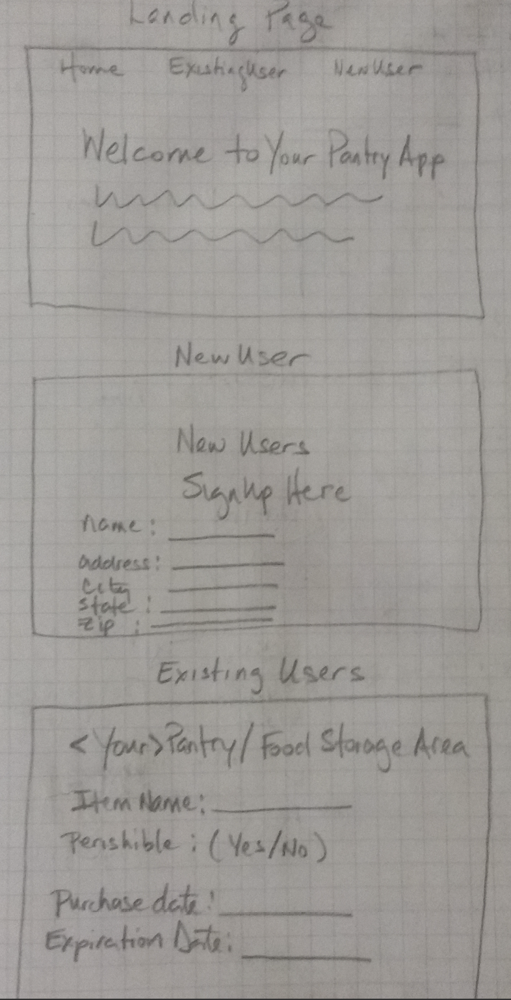

# Project-4: Building A Django + React App

## Overview

The objective of this project was to develop a web application using React as frontend with a Django REST Framework (DRF) backend connected through API calls utilzing Axios, the promise based HTTP client.  The engineer chose to undertake the development of an app that allowed its users to track pantry items and other perishable foodstuffs with their user account's virtual online pantry.  He has also leveraged 3rd party API so that PantryApp users can obtain listings of nearby locations where they might replenish their perishables.

**Live site demo:** <https://pantryonline.herokuapp.com/>
 

## Technologies Used

* Languages - Django, React, PostgresQL, Node JS, Python, Javascript, HTML5 & CSS3 
* Text Editor - Visual Studio Code v.1.33.0
* User Stories, Project Planning & Progress Tracking via [Trello](https://trello.com/invite/b/rqzYDFKM/ab03c2665926a2479292125a4afa5c5c/ga-sei-21-project-4)
* Designed and executed utilizing the methodologies, lessons, exercises and other information as provided over the course of GA's Software Engineering Immersive program (SEI-21) 

## Wireframe

Home, NewUser & Existing Users web pages

## WhiteBoard

Project planning ERM, MVC/MVT architecture, & Components diagram
 

## Main Application Process & Related Details

Your Pantry App (🍞yPa🥛) allows its users to manage and track perishable goods along with other pantry foodstuffs.  Whether its in the dry goods cabinet, refrigerator or that bunker you've setup for the zombie apocalypse, yPa is your food storage tracking solution.  

After setting up a user profile (including a zip code), identifing your pantry / food storage locations; and, 'virtually' storing your items within a designated location(s), the app's backend makes AJAX request to a 3rd party HTTP web API.  This returns a list of local Farmers Markets along with approximate distances (in miles) from the users zip code.

Routings on the backend, utilizing Django REST framework include: `/api/v1/userprofiles/`, `/api/v1/pantries/`, `/api/v1/items/`, and `/api/v1/markets/`.  Best practices in terms of following F.I.R.S.T guidelines for React components (i.e., focused, independent, reusable, small & testable) and for defining _RESTful_ routes using HTTP protocal. Full CRUD (Create, Read, Update & Delete) capability exists for model APIs (Users, Pantries and Items). The primary frontend routes are `/userslist`, `/pantries`, and `/items`. 

Finding a suitable web API provider, proved a challenge to successfully completing this project. In making a selection that satisfied this project's rubric, the developer initially identified potentially suitable service providers based upon the level of documentation available.  The concept of this pantry app was inspired by the 3rd party API services offered by a large grocery store chain operator -- the concept being the ability to show (get) locations based on a zip code, so users might replenish their pantry items.  However, the requirements of that web API were eventualy deemed too onerous.  

As a 2nd alternative, the developer identified a nationwide, big-box retailer's open API offerings. While that option would have meet requirments, the providor temporarily halted issuance of new API keys until 6/30/19 (beyond this project's due date).  After evaluating several other potential options, the developer settled upon the USDA's National Farmers Market Directory API.        

## Features

* Django app backend, utilizing Django Rest Framework 
* Single Page Application (SPA), client-side rendering of data via React to handle front-end UI  
* 3 model schemas - users, pantries & items
* Uses AJAX requests to create, read, udate and delete entities
* Backend makes AJAX requests to 3rd party HTTP web api

## Future Development

* Incorporate additional details specific to individual farmers market locations
* Add another web API to display nearby supermarket location in proximity to the user
* Include LatLong query parameters as the starting point for the 3rd party API 
