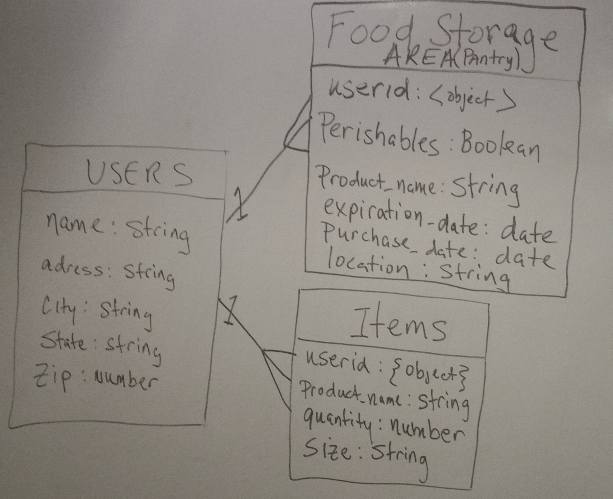
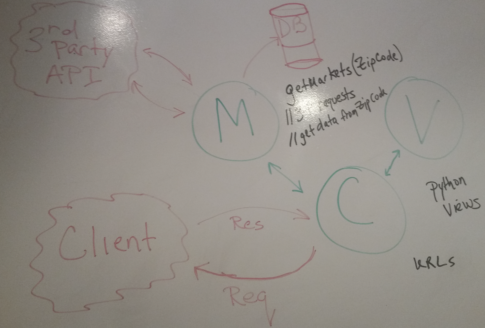
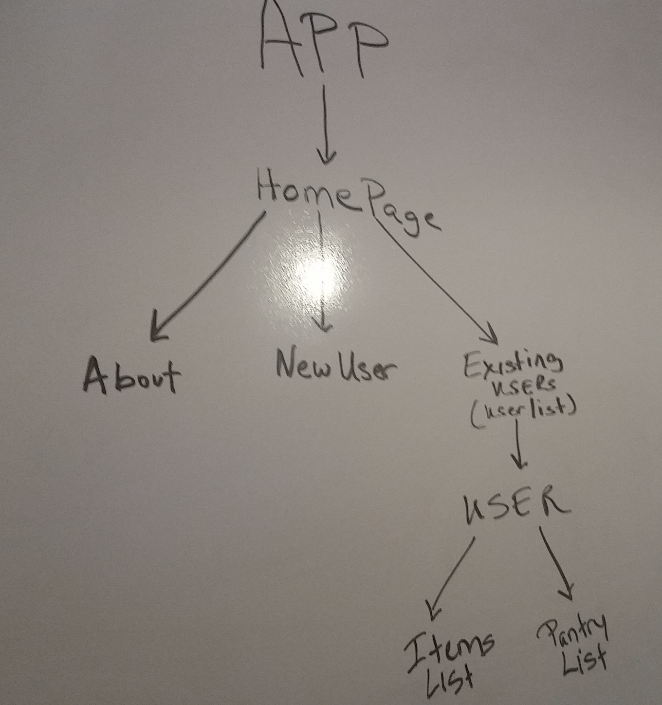

# Project-4: Building A Django + React App

## Overview

The objective of this project was to develop a web application using React as frontend with a Django REST Framework (DRF) backend connected through API calls utilzing Axios, the promise based HTTP client.  The engineer chose to undertake the development of an app that allowed its users to track pantry items and other perishable foodstuffs with their user account's virtual online pantry.  He has also leveraged 3rd party API(s) [from nationwide grocer(s)] so that PantryApp users can obtain listings of nearby store options where they might replenish their perishables.

**Live site demo:** <https://pantryonline.herokuapp.com/>
 

## Technologies Used

* Languages - Django, React, PostgresQL, Node JS, Python, Javascript, HTML5 & CSS3 
* Text Editor - Visual Studio Code v.1.33.0
* User Stories, Project Planning & Progress Tracking via [Trello](https://trello.com/invite/b/rqzYDFKM/ab03c2665926a2479292125a4afa5c5c/ga-sei-21-project-4)
* Designed and executed utilizing the methodologies, lessons, exercises and other information as provided over the course of GA's Software Engineering Immersive program (SEI-21) 

## Wireframe

## WhiteBoard

Project planning ERM, MVC/MVT, & components diagram
 

## Main Application Process & Related Details
Your Pantry App (🍞yPa🥛) allows its users to manage and track perishable goods and other pantry foodstuffs.  Whether its in the dry goods cabinet, refrigerator or that bunker you've setup for the zombie apocalypse, yPa is your food storage tracking solution.  After setting up a user profile (including a zip code), identifing your pantry / food storage locations; and, 'virtually' storing your items within a designated location(s), the app's backend makes AJAX request to a 3rd party HTTP web API.  This returns a list of local Farmers Markets along with approximate distances (in miles) from the users zip code.

## Features

## Future Development